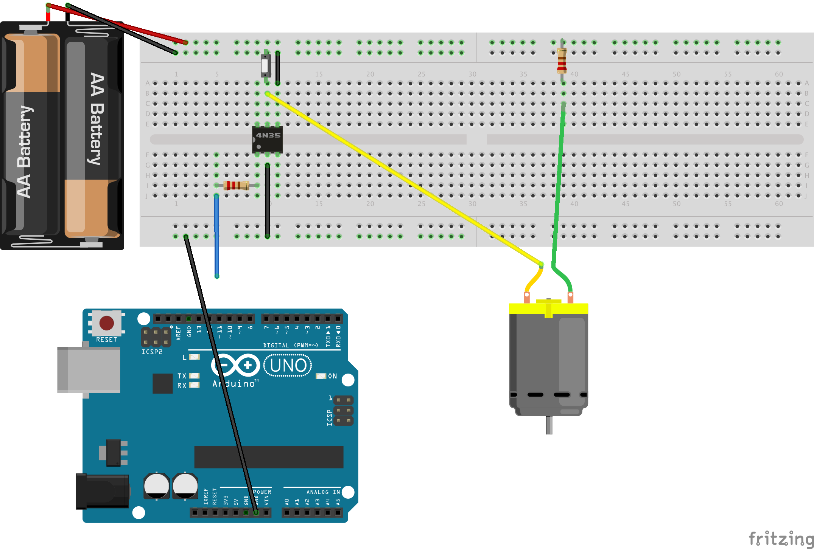
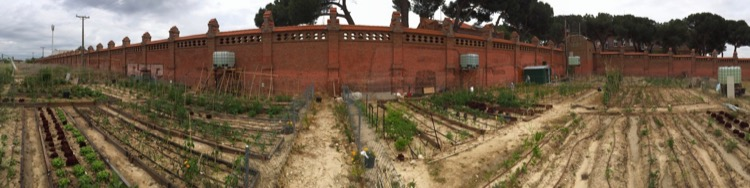
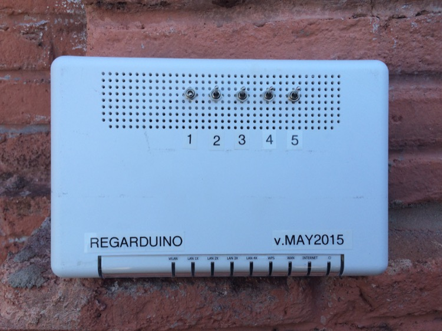
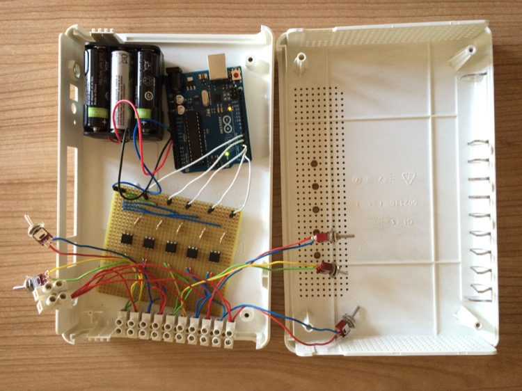
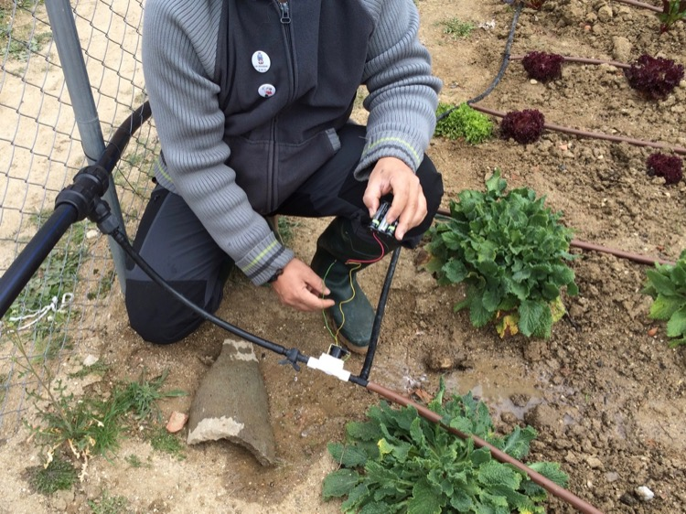
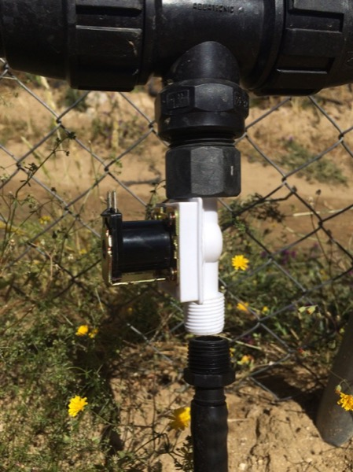

Regarduino
==========
Author: Francisco Gárate
Licence: GPLv3

A cheap and fully solution for water irrigation based on Arduino. Automatic controller for irrigation easily programmable (it's scheduled for 2 times every day). 

Requirements
------------
* For the Control-Box:
1 Box (in my case I reused an internet modem)
1 Arduino UNO
1 Battery 9V (for arduino) or usb power supply.
1 Battery 12V (for valves) or electricity supply.

* For each allotment/garden:
1 4N25 Optocoupler (optoacoplador)
1 Electric Solenoid Valves 12V (water valve 12V) 1/2''. Important: Closed by default. (About 4 EUR in eBay)
1 Switch on/off
2 resistor 220Ω
1 Valve box (water-resistant)

Circuit design
--------------

Real-word:
----------
- The code is designed for watering 5 sections (different allotments), 2 times every day. Nevertheless, arduino code is easy to understand/change.

- Also, the box include and on/off switch (as 'brigde') for watering manually.

- In this case, both power supply (valves and arduino) are independent. The main reason is due the Arduino count-down is reset in each power cut. Also, the arduino reached high temperatura with 12V. At home, USB power supply is the ideal.

Electric Solenoid Valves
------------------------
1 Electric Solenoid Valves 12V (water valve 12V) 1/2''. 
Important: Closed by default. (About 4 EUR in eBay)

License
-------
GPL (GENERAL PUBLIC LICENSE) - Open source

